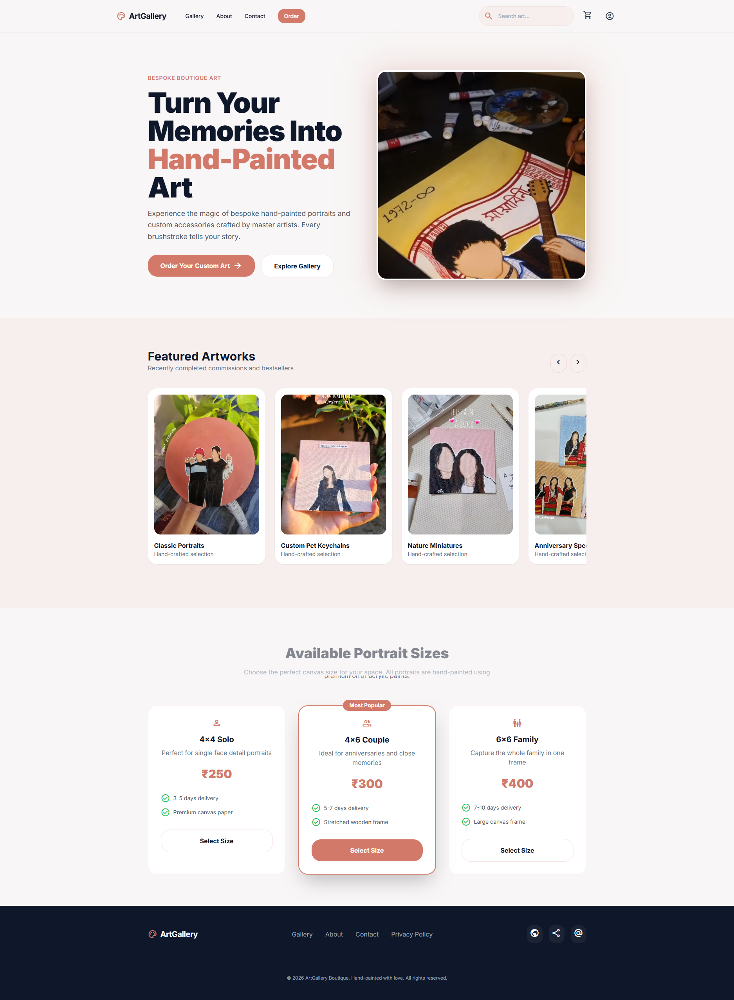
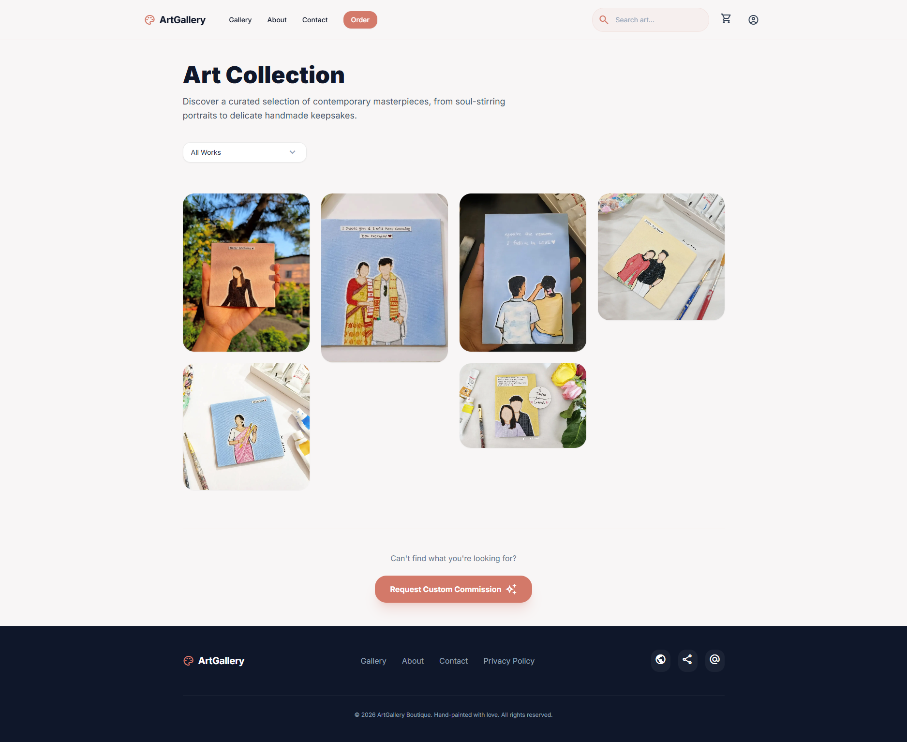
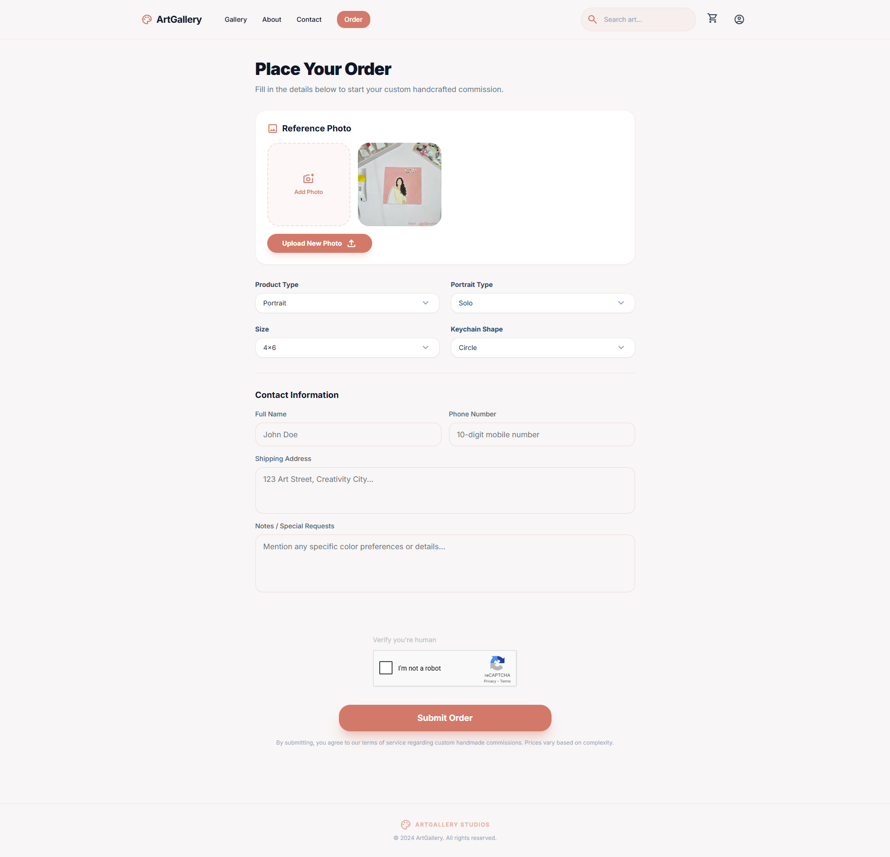
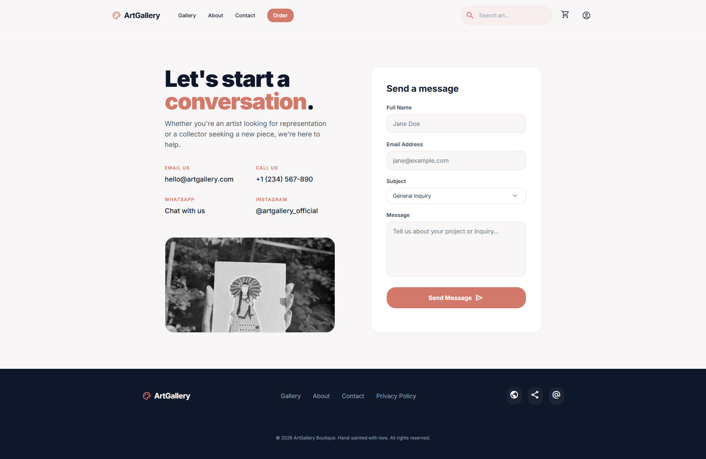
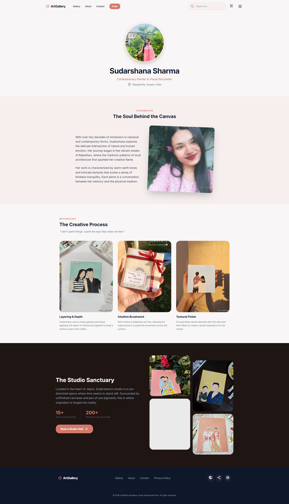
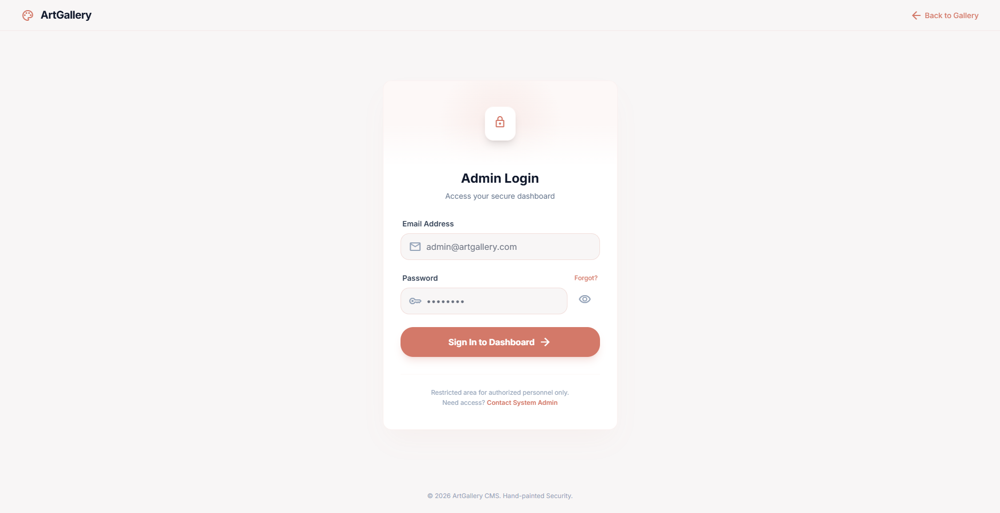
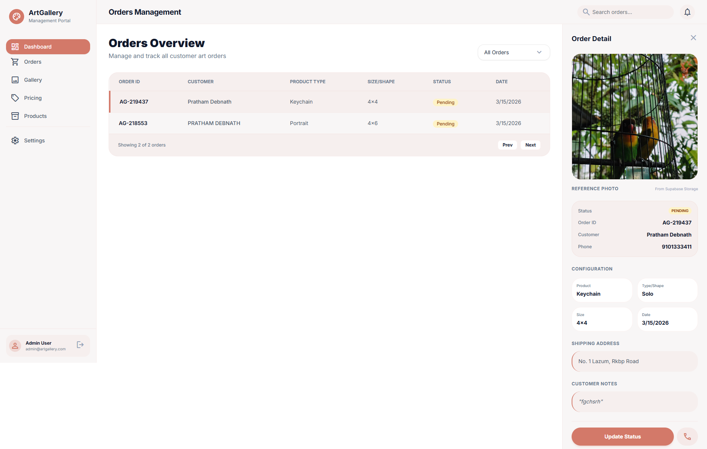
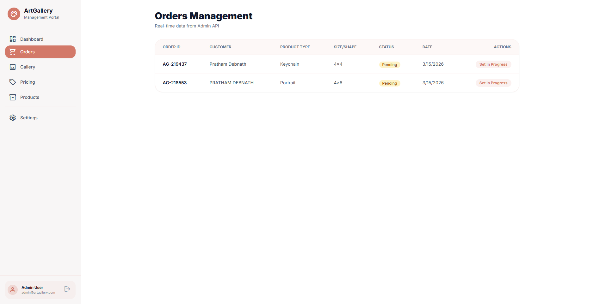
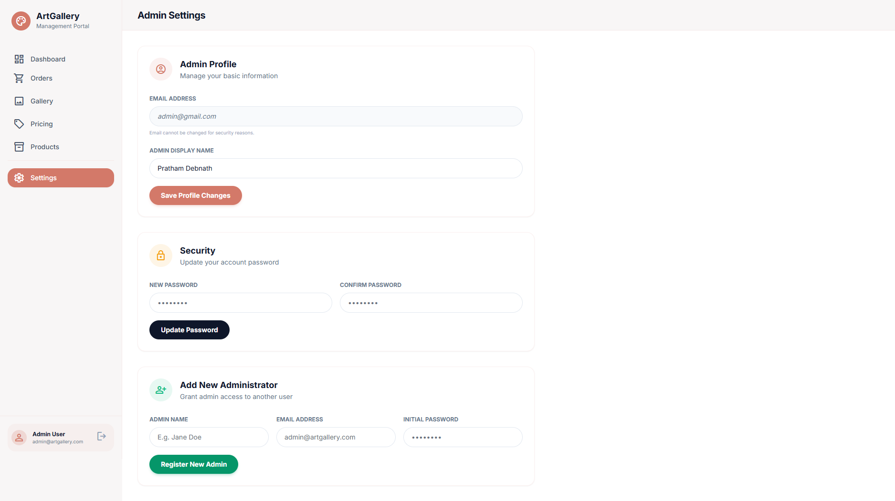

# ArtGallery — Custom Art Order Management Platform
Live on: artgallery-murex-phi.vercel.app/

ArtGallery is a full-stack web application designed for managing bespoke, hand-painted artwork orders. It provides a seamless experience for customers to place custom orders and a secure, powerful dashboard for admins to manage these requests.

## Project Overview

ArtGallery serves as a bridge between master artists and clients. Clients can upload reference images and specify details for custom portraits or keychains. The platform streamlines the administrative overhead by providing a centralized dashboard for order tracking, status updates, and image management.

---

## Features

### 🎨 Customer Features
- **Custom Artwork Ordering**: Intuitive form to select product types (Portrait, Keychain).
- **Flexible Options**: Choose sizes, shapes, and portrait styles (Solo, Couple, Family).
- **Reference Image Upload**: Seamless integration with Supabase Storage for high-quality reference photo uploads.
- **WhatsApp Integration**: Streamlined communication for order confirmation.
- **Responsive Design**: Elegant, Apple-style minimalist UI built for all screen sizes.

### 🔐 Admin Features
- **Secure Admin Dashboard**: Protected overview of all incoming orders.
- **Order Management**: View detailed order summaries, reference images, and customer contact info.
- **Real-time Status Updates**: Transition orders through various stages (Pending, Processing, Completed, etc.).
- **Admin Settings**: Manage admin credentials and profile information.
- **Authentication**: Robust login system powered by Supabase Auth and Table-based authorization.

### 🛡️ Security Features
- **Bot Protection**: Integration of **Google reCAPTCHA v2** to prevent automated spam.
- **Anti-Bot Honeypot**: Hidden fields to detect and block sophisticated bot submissions.
- **Input Validation**: Strict Indian phone number validation (10-digit, starting with 6-9).
- **Middleware Security**: Server-side route protection for all `/admin` paths.
- **Environment Safety**: Sensitive keys managed via environment variables.

---

## Application Screenshots

### Main Landing Page


---

### Gallery Page


---

### Order Page


---

### Contact Page


---

### About Page


---

### Admin Login


---

### Admin Dashboard


---

### Admin Orders Panel


---

### Admin Settings


---

## Tech Stack

### Frontend
- **Framework**: [Next.js 14](https://nextjs.org/) (App Router)
- **Library**: [React 18](https://react.dev/)
- **Styling**: [Tailwind CSS](https://tailwindcss.com/)
- **Animations**: [Framer Motion](https://www.framer.com/motion/)
- **Icons**: Material Symbols Outlined

### Backend & Database
- **Database**: [PostgreSQL](https://www.postgresql.org/) (via [Supabase](https://supabase.com/))
- **Authentication**: Supabase Auth
- **Storage**: Supabase Storage Buckets
- **Server Logic**: Next.js API Routes (Route Handlers)

### Security & Others
- **Bot Defense**: Google reCAPTCHA v2
- **Language**: [TypeScript](https://www.typescriptlang.org/)

---

## Project Structure

```text
art-gallery/
├── app/
│   ├── admin/                # Admin portal routes
│   │   ├── dashboard/        # Main order overview
│   │   ├── login/            # Admin authentication
│   │   ├── orders/           # Detailed order views
│   │   └── settings/         # Admin account management
│   ├── api/                  # Server-side API endpoints
│   │   └── admin/            # Protected admin actions
│   ├── order/                # Customer order form
│   ├── order-success/        # Post-submission confirmation
│   └── layout.tsx            # Root layout & configuration
├── components/
│   ├── admin/                # Admin-specific UI components
│   ├── layout/               # Shared layout (Navbar, etc.)
│   ├── order/                # Order form logic & components
│   └── ui/                   # Reusable base UI elements
├── lib/                      # Supabase & utility clients
├── public/                   # Static assets & gallery images
├── styles/                   # Global CSS & Tailwind layers
└── middleware.ts             # Global admin route protection
```

---

## Database Design

The project utilizes two primary tables in Supabase:

### `orders` Table
Stores all incoming customer orders.
- `id`: Auto-generated UUID.
- `order_number`: Unique alphanumeric ID (e.g., AG-123456).
- `customer_name`: Name of the client.
- `phone`: Validated 10-digit Indian mobile number.
- `address`: Shipping address.
- `product_type`: Portrait or Keychain.
- `portrait_type`: Solo, Couple, or Family.
- `size`: Selected dimensions (e.g., 4x6, 6x6).
- `keychain_shape`: Circle, Square, or Custom.
- `notes`: Additional customer instructions.
- `reference_image`: Public URL of the uploaded image.
- `status`: Order progress (Pending, In Progress, Shipped, etc.).

### `admin_users` Table
Handles authorized admin access.
- `id`: Unique identifier.
- `user_id`: Linked to Supabase Auth `uid`.
- `email`: Admin email address.
- `full_name`: Admin display name.

---

## Order Flow

1. **User Input**: Customer fills out the order form and uploads a reference photo.
2. **Security Checks**: System runs reCAPTCHA verification and checks the honeypot field.
3. **Validation**: Phone number and required fields are validated on the client side.
4. **Image Upload**: The reference file is uploaded to the `order-images` Supabase Storage bucket.
5. **Database Entry**: A new order record is created with a generated Order ID.
6. **Confirmation**: Customer is redirected to the success page with order details.

---

## Admin Workflow

1. **Login**: Admin authenticates via the `/admin/login` page.
2. **Middleware**: System verifies the user's session and checks if they exist in the `admin_users` table.
3. **Overview**: Admin lands on the Dashboard to see an overview of all orders.
4. **Action**: Admin can select an order to view the full details, preview the reference image, and update the order status.

---

## Image Storage System

ArtGallery uses **Supabase Storage** for managing client reference photos:
- **Bucket Name**: `order-images`.
- **Naming Pattern**: `{customer_name}_{order_id}.{extension}`.
- **Accessibility**: Public URLs are generated upon successful upload and stored in the database.

---

## Installation Guide

To run ArtGallery locally, follow these steps:

1. **Clone the repository**:
   ```bash
   git clone https://github.com/isthatpratham/artgallery.git
   cd art-gallery
   ```

2. **Install dependencies**:
   ```bash
   npm install
   ```

3. **Set up environment variables**:
   Create a `.env.local` file in the root directory (see section below).

4. **Run the development server**:
   ```bash
   npm run dev
   ```
   Open [http://localhost:3000](http://localhost:3000) to view the app.

---

## Environment Variables

The following variables are required in your `.env.local` file:

| Variable | Description |
| :--- | :--- |
| `NEXT_PUBLIC_SUPABASE_URL` | Your Supabase Project URL |
| `NEXT_PUBLIC_SUPABASE_PUBLISHABLE_KEY` | Supabase Anon/Public Key |
| `SUPABASE_SERVICE_ROLE_KEY` | Supabase Service Role Key (for admin tasks) |
| `NEXT_PUBLIC_RECAPTCHA_SITE_KEY` | Google reCAPTCHA v2 Site Key |
| `RECAPTCHA_SECRET_KEY` | Google reCAPTCHA v2 Secret Key |

---

## Deployment

The project is optimized for deployment on **Vercel**:
1. Connect your GitHub repository to Vercel.
2. Add all the variables from your `.env.local` to the Vercel Environment Variables settings.
3. Deploy!

---

## Future Improvements

- **Order Tracking**: Client-side page to track order status using Order ID.
- **Payment Integration**: Secure payment gateway for upfront or partial payments.
- **Push Notifications**: Real-time updates for admins and order status alerts for clients.
- **Enhanced Gallery**: Dynamic gallery system with artist-curated categories.

---

**Author**: [Pratham](https://github.com/isthatpratham)
